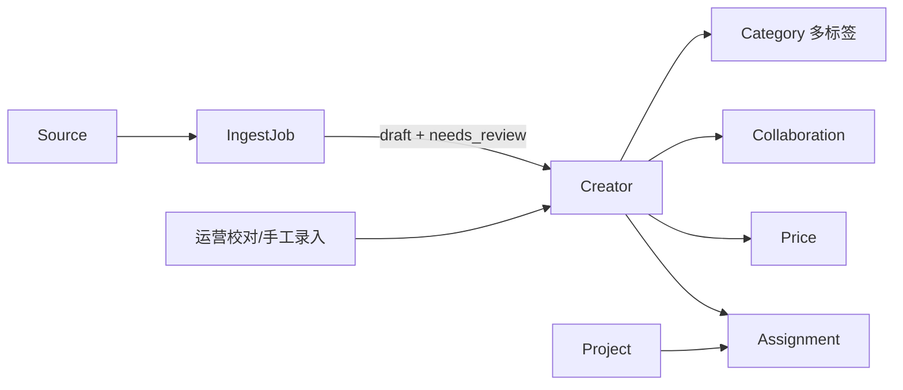

# 领域模型

> 术语与不变量的 SSOT。产品规则见 [`PRD.md`](./PRD.md)。流程见 [`UX-FLOWS.md`](./UX-FLOWS.md)。
> 旧 Demo 的 Score / AIReview / 导出表行模型**不是**本文件实体。冲突以本文件为准。

一句话：运营把 **Creator** 整理进发布池（分类、履历、报价），选人公司用 **Project + Assignment** 把人领走。**IngestJob** 只负责按已配置源写入待校对的人。

---

## 不变量

1. **发布池：** 前台只读 `status=released` 且未打 `blacklist` 的 Creator。
2. **身份键：** `creator_key` 稳定。缺外部 id 时系统给占位键。去重、Job 重试、再发布都靠它，不靠排名。
3. **履历派生：** `has_collaborated = (Collaboration 条数 > 0)`。筛「是否合作过」用这个值，不用分类标签代替。
4. **分类多标签：** 除 `coop_history` 组内互斥外，标签可叠打。运营可增自定义分类。
5. **Job 不复制人：** 同一 `creator_key` 被再次写入 = 更新待校对字段，不插入第二个 Creator。
6. **密钥不上业务对象：** IngestJob / Source 只存引用与「已配置」布尔；错误摘要去密钥。
7. **展示语言** `zh-CN` / `en` / `ko` 只换 chrome。显示名、品牌、备注保持原文。
8. **分配可撤销：** 移出 = 删除 Assignment，可再次分配。拒绝 = `rejected`，仍留在项目里直到改回或移出。

---

## 实体

### Creator（达人）

被挑选的人。_Avoid:_ 博主、蒲公英行、user（与登录账号混淆）、Talent（旧稿用过，现统一 Creator）。

| 字段 | 含义 |
|------|------|
| `creator_key` | 稳定键 |
| `display_name` | 展示名（原文） |
| `status` | `draft` / `ready` / `released` |
| `needs_review` | 自动写入后待校对 |
| `followers` | 粉丝量；未知则空 + `followers_unknown=true` |
| `regions[]` | 地区 |
| `verticals[]` | 品类 |
| `rating` | 0–5，一位小数，运营维护；可空 |
| `available_from` / `available_to` | 可合作窗口；可空 |
| `categories[]` | 见 Category |
| `last_ingest_job_id` | 仅后台 |

前台可见字段与后台差见 PRD §7。

### Category（分类）

多标签词表。_Avoid:_ 单选文件夹、把品类硬塞进分类（品类是 Creator.verticals）。

| 字段 | 含义 |
|------|------|
| `slug` | 稳定机读名 |
| `names` | zh-CN / en / ko 显示名 |
| `builtin` | 内置不可删 |
| `enabled` | 停用后不可新打 |
| `group` | 空，或 `coop_history` |
| `frontend_visible` | 自定义分类可关 |

内置 slug（必须）：`collaborated`、`never_collaborated`。建议内置：`intending`、`blacklist`、`stale`。语义见 PRD §5。

`coop_history`：最多一个。有 Collaboration 时系统写成 `collaborated`，否则 `never_collaborated`。与履历不一致时后台打冲突标记，不挡发布。

### Collaboration（合作履历）

一条「跟某个品牌做过什么」。_Avoid:_ 合同、结算、报名。

| 字段 | 含义 |
|------|------|
| `creator_id` | 所属人 |
| `brand` | 品牌名（原文） |
| `happened_at` | 合作时间，可空 |
| `note` | 备注，可空 |

派生：`collab_count`、`collab_brands[]`、`has_collaborated`。前台只展示派生摘要；后台展示逐条。

### Price（报价）

当前可合作价格。_Avoid:_ 结算价、平台抽成。

| 字段 | 含义 |
|------|------|
| `creator_id` | 所属人 |
| `amount_min` / `amount_max` | 区间；可单端 |
| `currency` | 如 `CNY` / `KRW` / `USD` |
| `unit` | 如 per_post / per_video / other |
| `valid_until` | 可空 |

筛报价 = 用户区间与该区间有重叠。排序「按价格」= `amount_min` 升或降。无报价的人在按价格排序时沉底。

### Project（项目）

选人公司的一次选人容器。_Avoid:_ Campaign（旧招募）、广告计划。

| 字段 | 含义 |
|------|------|
| `org_id` | 所属选人公司（M1 一个 Org） |
| `name` | 必填 |
| `note` | 可空 |
| `status` | `open` / `archived` |
| `updated_at` | 列表默认序 |

项目不拥有 Creator；只拥有 Assignment。

### Assignment（分配）

Creator × Project。_Avoid:_ 报名、合同、短名单导出文件（导出不是本实体）。

| 字段 | 含义 |
|------|------|
| `project_id` / `creator_id` | 联合唯一：同一人在同一项目一条 |
| `status` | `assigned` / `rejected` |
| `assigned_at` / `assigned_by` | 审计 |
| `pool_gone` | 分配后该人被撤回发布时为 true；不自动删行 |

移出 = 删行（撤销）。再分配 = 新建或恢复为 `assigned`。

### IngestJob（入库任务）

一次（或周期计划下的一次执行）从已配置 Source 拉人。_Avoid:_ 爬虫脚本、选人筛选器、未登记 URL。

| 字段 | 含义 |
|------|------|
| `source_id` | 已登记 Source |
| `schedule` | `once` 或周期表达式 |
| `status` | `queued` / `running` / `ok` / `failed` / `cancelled` |
| `attempt` | 重试次数 |
| `written_count` / `skipped_dupes` / `failed_count` | 结果计数 |
| `error_code` / `error_summary` | 失败可见；无密钥 |
| `opened_by` / `started_at` / `ended_at` | 审计 |
| `sample_rate` | 抽检比例，默认 0.1 且至少 1 人 |

Source（附属，不另开成选人实体）：`name`、`adapter_type`（授权 API / 已登记连接器 / 文件投递）、`enabled`、限速、配额、负责人。未启用不可被 Job 选中。

适配器怎么连到外部系统是实现细节，**不进本领域说明**。产品只要求：有类型、能开关、能失败、能审计。

---

## 关系

数据方向：Source → Job → 待校对 Creator → 发布 → Assignment。监测只读 Job/Source。选人只写 Assignment。

---

## 边界场景

| 场景 | 结果 |
|------|------|
| 有履历但运营打了「没合作过的」 | 后台冲突角标；`has_collaborated=true`；前台「是否合作过」= 是 |
| 打了黑名单后仍 `released` | 发布池视为未发布；已有 Assignment 留着并 `pool_gone` |
| 同一人被 Job 拉两次 | 更新草稿字段，计数 `skipped_dupes`+1 或 written 为更新，不新增 Creator |
| 选人筛「合作过的」分类 + 「是否合作过=否」 | AND 后常为空；走空态，不报系统错 |
| 无评分 | 前台默认排序沉到有评分的人后面，再按粉丝量 |
| 无可用授权源 | 用文件投递 Source 验收同一套 Job 状态机 |
| 未登录看库 | `AUTH-LOGIN`，不返回发布池 JSON |
