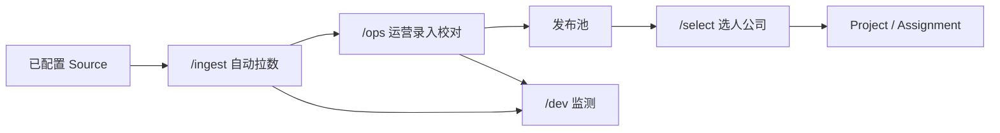

# UX 流程 — 四条主路径

> 对照 [`PRD.md`](./PRD.md) §4 / §8 / §9，屏 id 见 [`SCREEN-INVENTORY.md`](./SCREEN-INVENTORY.md)。
> 这些是新 UI 目标流。`docs/00_*`、`archive/`、旧 V1 zip 是**旧 Demo，不是本产品**，不要抄它们的「导入表 → 跑分 → 导出」当主路径。
> 每条主路径必须同时具备：入口、进行中、成功、失败、空态、权限不够。缺一项 = 未完成。

`locale ∈ {zh-CN, en, ko}`。顶栏切语言与浅色/深色。显示名、品牌名、手写备注保持原文。

---

## 工作区（四块，不要混）

| 工作区 | 路由根 | 主用户 | 主路径 |
|--------|--------|--------|--------|
| 前台 · 选人 | `/{locale}/select` | 选人公司 | 进项目 → 筛库 → 分配 |
| 后台 · 录入 | `/{locale}/ops` | 平台运营 | 开库存 → 录入或校对 → 发布 |
| 后台 · 监测 | `/{locale}/dev` | 开发 / 运维 | 看健康 → 打开失败任务 → 重试或结案 |
| 后台 · 自动拉数 | `/{locale}/ingest` | 运营配任务；运维看失败 | 选源 → 设周期或立即跑 → 看状态 / 抽检 |

前台导航只有选人。录入、监测、自动拉数互链，但**都不链进前台选人主按钮**。

---

## 1. 前台选人（≤ 3 步）

讲解口径只讲这三步。详情、筛选抽屉、确认框都算步内附属，不另报第四步。

### 步骤

| 步 | 动作 | 屏 | 完成标准 |
|----|------|----|----------|
| 1 进项目 | 登录后进入项目列表；点已有项目，或新建后进入 | `SEL-PROJECT-LIST` →（`SEL-PROJECT-NEW`）→ `SEL-PROJECT` | 当前项目已选定，工作台标题是该项目名 |
| 2 筛库 | 项目内主按钮「从库选人」进入发布池；用默认筛，可加多条件 | `SEL-LIBRARY`（带 `project` 上下文） | 列表来自发布池；筛芯片可见；无人时是空态而不是报错 |
| 3 分配 | 勾选一人或多人，确认加入当前项目 | `SEL-ASSIGN`（可为确认层）→ 回 `SEL-PROJECT` | 名单出现 `assigned`；可点「移出」撤销 |

点开 `SEL-CREATOR` 是步 2 的附属：看完可「加入当前项目」，仍算第 3 步，不新增业务步。

### 六态

| 态 | 表现 |
|----|------|
| 入口 | 选人角色登录 → `/select`。无项目时主按钮是「新建项目」，不是「录入达人」 |
| 进行中 | 分配请求中：主按钮禁用 + 「正在加入…」；筛选请求中：表区骨架，不闪空 |
| 成功 | 项目名单出现该人；轻提示可撤（移出）。再分配同一人：提示已在项目，不复制 |
| 失败 | 网络/校验失败：保留勾选，错误条 + 重试。已不在库（被撤回）的人不能新分配，已在名单的标「已不在库」 |
| 空态 | 无项目 → 新建。库 0 人 → 「发布池还没有人」（不给运营入口）。筛后 0 人 → 「清空筛选」 |
| 权限不够 | 选人打开 `/ops` `/dev` `/ingest` → `AUTH-DENIED`，零库存 payload |

### 不做

对比墙、管道图、源任务、草稿达人、改分类、改报价。导出若后期做，挂在项目里，不是第 4 条必做步。

---

## 2. 后台录入

运营把人变成前台能看见的人。两条入口汇合到同一校对/发布，不拆成两套库存。

### 步骤（少而全）

| 步 | 动作 | 屏 | 完成标准 |
|----|------|----|----------|
| 1 开库存 | 进入录入首页或库存列表 | `OPS-HOME` / `OPS-CREATOR-LIST` | 能看见人数、待校对数、最近发布 |
| 2a 手工录入 **或** 2b 校对自动结果 | 2a 新建一人并保存为 `draft`/`ready`。2b 打开待校对队列，逐条或抽检通过 | `OPS-CREATOR-NEW` / `OPS-CREATOR-EDIT` / `OPS-REVIEW` | 该人必填齐，或明确标「粉丝未知」等；分类已打（至少 `coop_history` 一组） |
| 3 发布 | 详情或列表点「发布」，二次确认 | `OPS-CREATOR-DETAIL` | `status=released`；前台库立即可见（非黑名单）。可「撤回」撤销 |

维护分类（`OPS-CATEGORY`）是旁路：随时可进，不插入主路径当必做第 4 步。履历与报价在编辑页内完成，不强制另开向导。

### 六态

| 态 | 表现 |
|----|------|
| 入口 | 运营登录 → `/ops`。首页主按钮：库存为空时「录入第一人」；有待校对「去校对」 |
| 进行中 | 保存/发布中禁用主按钮；自动结果未加载完显示队列骨架 |
| 成功 | 保存后回详情或列表，状态徽章更新。发布成功提示含「去前台查看」仅作只读跳转说明（M1 可用文案，不自动切账号） |
| 失败 | 校验失败：字段旁错误，不丢已填。发布失败（例如中途被打黑名单）：留在详情 |
| 空态 | 库存 0：「录入达人」+「去看入库任务」。待校对 0：「没有待校对」 |
| 权限不够 | 选人/运维写录入接口 → 403。运维只读监测，不改业务字段 |

### 不做

六维跑分向导、AI 复核队列当主作业、把 Excel 列映射做成产品第一章。文件投递若存在，它是 Source 的一种，走自动拉数 + 本路径校对。

---

## 3. 后台监测

运维确认管道活着，并能处理失败。不挑人。

### 步骤

| 步 | 动作 | 屏 | 完成标准 |
|----|------|----|----------|
| 1 看健康 | 打开总览 | `DEV-HEALTH` | 能判断：服务是否起来、最近成功/失败、源启用数 |
| 2 打开任务 | 进任务表，必要时筛失败 | `DEV-JOBS` | 每条有状态；失败行高亮 |
| 3 处理失败 | 打开详情，读摘要，确认重试或标已知晓 | `DEV-JOB-DETAIL` | 重试产生新一次执行记录（或同一 Job 的新 attempt），旧失败仍可查 |

管道图（`DEV-PIPELINE`）是步 1 的加深，M1 可用数字卡片代替独立页。

### 六态

| 态 | 表现 |
|----|------|
| 入口 | 运维登录 → `/dev`。选人进 `/dev` → `AUTH-DENIED` |
| 进行中 | 重试已点：该行 `queued`/`running`，不能连点打出一排重试 |
| 成功 | 健康绿或「最近一次成功」有时间戳；重试成功后行转 `ok` |
| 失败 | 健康红 + 链到失败任务。详情必须有错误摘要（无密钥、无 cookie） |
| 空态 | 从未跑过 Job：「还没有任务」+ 链到 `/ingest` 配置（只读说明也可以） |
| 权限不够 | 运维调发布/分配/改报价 → 403。运营可只读健康，不重试（M1：重试仅运维） |

### 不做

达人库表格、推荐、改分类、在监测页配新 Source（配源在 `/ingest`）。

---

## 4. 自动拉数

产品语言：入库任务。UI 只选已配置 Source、周期、开跑、看状态、抽检。

### 步骤

| 步 | 动作 | 屏 | 完成标准 |
|----|------|----|----------|
| 1 选源 | 打开已登记 Source；未启用的不能当开跑目标 | `ING-SOURCE-LIST` | 当前选中的 Source `enabled=true`，限速/配额可见 |
| 2 配任务并开跑 | 新建 Job：选源、手动一次或设周期，确认开跑 | `ING-JOB-NEW` → `ING-JOB-DETAIL` | Job 进入 `queued`/`running`；未开跑可取消 |
| 3 看结果并抽检 | 成功则看写入条数，抽检样本进运营校对；失败则看摘要，运维可重试 | `ING-JOB-DETAIL` / `ING-SAMPLE` / `OPS-REVIEW` | `ok`：写入按 `creator_key` 去重且人为 `draft+needs_review`。`failed`：原因可见，数据未复制一份脏成功 |

周期任务：下次运行时间写在 Job/计划上。运维在 `/dev` 看到同一 Job，不在监测页再配一份。

### 六态

| 态 | 表现 |
|----|------|
| 入口 | `/ingest`。无 Source：「尚无可用来源」+ 说明找运维登记（不给「贴 URL 开跑」） |
| 进行中 | `running`：进度或心跳时间；禁止改同一 Job 的源 |
| 成功 | `ok` + 写入 N / 跳过（去重）M；主按钮「抽检」或「去校对」 |
| 失败 | `failed` + 错误码/摘要；主按钮「重试」（运维）或「改源后再开」（运营，新 Job） |
| 空态 | 无 Job：「配置第一条任务」。抽检池 0：任务成功但无可抽样本时明示「写入 0」 |
| 权限不够 | 选人进 `/ingest` → `AUTH-DENIED`。未启用源被选 → 提交失败，不静默开跑 |

### 硬限制（写进验收，不写破站）

- 只有已配置 Source。
- 超限、源关闭、适配器不可用 → `failed`，可见。
- 不出现具体站点的登录、验证码、抓取步骤。适配器内部不在 UI 展开成菜谱。

---

## 权限跳转

| 从 | 到非法处 | 行为 |
|----|----------|------|
| 选人 | `/ops/*` `/dev/*` `/ingest/*` | `AUTH-DENIED`，不返回草稿/失败栈 |
| 运营 | 写别人的 Assignment；运维重试（M1） | 403 |
| 运维 | 写 Creator 业务字段、发布、分配 | 403 |
| 未登录 | 任一业务页 | `AUTH-LOGIN` |

---

## 跨路径串联（讲解 1 次即可）

1. 运维确认 `/dev` 空态诚实（尚无成功 Job）。
2. 运营或运维在 `/ingest` 对已配置 Source 开一条 Job（或运营纯手工录入，跳过本步）。
3. 运营在 `/ops` 校对并发布。
4. 选人在 `/select` 走完 3 步。
5. 中途切 `en` / `ko` 与深色：chrome 变，显示名与品牌原文不变。

完成标准：无外部授权源时，用文件投递 Source + 手工录入两条都能走到第 4 步。前台始终看不到第 2 步的失败栈。
