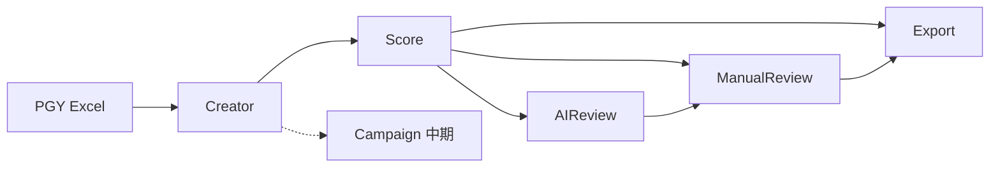

# 领域模型

> 项目：`korea-creator-system`。本文件是术语与不变量的 SSOT。
> 无实现细节。栈见 [`TINYSHIP-REBUILD.md`](./TINYSHIP-REBUILD.md)。
> 旧 CSV/JSON 字段名可作映射参考，不是新库表设计。

韩国品牌小红书达人筛选：一条 **Creator** 经过确定性 **Score**，可选 **AIReview**，再经 **ManualReview**，进入 **Export**。**Campaign** 只是中期占位（联系跟进），不是 MVP 实体。

## 不变量

1. **规则排序**：`Score.final` / `grade` / `rank` 只由规则引擎 + 当前规则版本产生。
2. **风险复核**：`AIReview` 只写决策与文本，禁止写回 Score。
3. **人工确认**：`ManualReview` 只写决策、备注、原因标签，禁止写回 Score。
4. 身份键是 `creator_key`，不是排名。排名随批次/规则版本变化。

## 实体

### Creator（达人）

蒲公英一行去重后的人。`creator_key = userId > 小红书号 > 小红书主页URL`；三者皆缺则稳定占位键（旧实现用 `missing_key_row_{源行号}`）。
_Avoid_: 博主、账号、user（与平台三角色用户混淆）

关键事实：昵称、小红书号、地域、身份|人设、内容类目|标签、粉丝、阅读/互动中位数、ER、报价、抓取关键词、来源行。

### Score（规则分）

一次分析运行上、一条 Creator 的六维分 + 风险扣分 + 最终分 + 等级 + 排名。
_Avoid_: AI分、推荐分（听起来像 AI 在打分）

维度（V1 计划权重）：分层筛选 25%、关键词组合 15%、韩国品牌 25%、潜力合作 20%、表现 10%、性价比 5%；风险 0～-10。解释字段：命中内容/韩国/品牌词、`risk_reasons`、`exclude_flag`。

等级短标签：S/A/B/C/D。阈值属规则版本，不是 AI 输出。

### AIReview（风险复核）

对 Top50（MVP 范围）的解释层。决策：`recommend` | `cautious` | `reject`。来源：`success` | `fallback` | `pending` | `failed`。
_Avoid_: AI推荐、AI排名、recommendation（易被做成改排序）

与规则的 Alignment（只基于 `success`）：`hard_conflict` | `soft_divergence` | `consistent` | `unknown`（fallback 进 unknown，不进真实冲突率）。旧口径见 `docs/01_开发日志.md` 第八阶段 A.1。

### ManualReview（人工确认）

四态：推荐 / 不推荐 / 待确认 / 已复核。可附备注、原因标签。不改分。
_Avoid_: 人工改分、终分覆盖

旧缓存曾用 `rank` 当键——新模型必须用 `creator_key`（+ `analysis_run_id`）。

### Export（导出）

某一分析运行的快照文件：Top10 / Top50 / 全量 + 标注。带时间戳。MVP：Excel / CSV。
_Avoid_: 把导出当邮件发送

### Campaign（联系跟进，占位）

中期才做：联系状态、渠道、报价三档（平台参考 / 询价 / 最终）。MVP 不建。不是自动群发。
_Avoid_: 邮件触达已交付、SMTP 已接入

### AnalysisRun / RuleVersion（中期）

同一批 Creator 可在不同对比范围或规则版本下重跑，旧结果不覆盖。MVP 可先 implicit「当前一次运行」。V2 计划里的批次分析、规则复盘依赖这两类，不要提前做完整版本中心。

## 关系

## 场景（边界）

- Top10 全是 A 且 AI 全是 cautious：Alignment = `soft_divergence`，排名不动。
- 人把第 1 名标成不推荐：导出带「不推荐」，`rank` 仍为 1。
- 无 DeepSeek Key：50 条 fallback，Demo 仍可讲；真实决策分母 = 0。
- 新 Excel 批次：新 AnalysisRun；旧 Creator 用 `creator_key` 对齐，不靠旧 rank。
