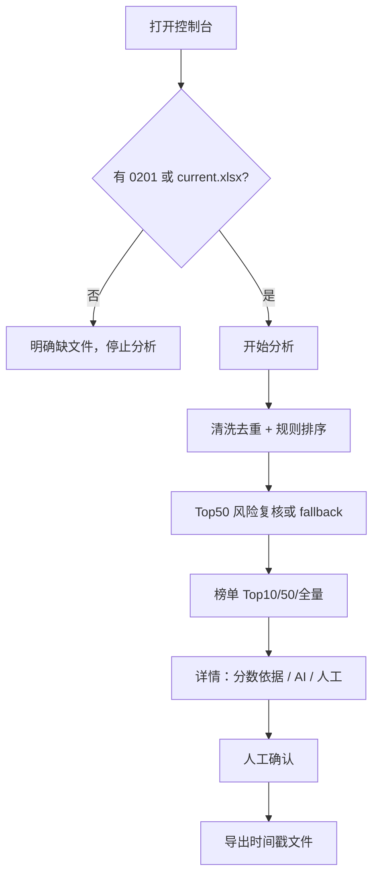

# UX 流程（绿地）

> 项目：`korea-creator-system`。显示名：全球达人情报系统。
> 这些是 **tinyship + forge + overlay** 新 UI 的目标流，不是 `archive/` 里的旧单页。
> 线框参考只读 `archive/` 里的旧前端（见墓碑），不要在 archive 上改交互当交付。仓库根没有可改的 `templates/` / `static/`。
> 视觉与组件约定若 `TINYSHIP-REBUILD.md` 有写，以那份为准。

## 信息架构（V1 六个轻量面）

1. **控制台** — 数据文件状态、Key 是否可用、最近一次分析、开始分析。
2. **榜单** — Top10 / Top50 / 全量；筛等级 / 关键词 / 人工态；打开详情。
3. **详情** — 基础字段、六维条/雷达、AI 文本、人工标注。可用抽屉，不要强迫独立路由。
4. **规则** — MVP **只读** 展示当前权重与扣分口径；可编辑是中期。
5. **人工复核** — 待确认池、已复核、与 AI 分歧列表。写入同一套 ManualReview。
6. **导出** — 最近文件、重新导出 Excel/CSV、命名含时间戳。

中英韩：**硬约束**。计划书「V1 中文、V1.1 语言包」已作废。第一刀宿主就要顶栏切换 `zh-CN` / `en` / `ko`；主路径与讲解路径都按三语可走，不是中文讲完再补包。实现见 `TINYSHIP-REBUILD.md` §5.1（前缀 `/zh-CN` `/en` `/ko`，`?lang=` 薄适配到前缀）。豁免原文：昵称、小红书号、原始抓取关键词、手写备注。切语言只换 chrome，不改分、不重跑分析。

## 主路径

完成标准：无 API Key 时也能从 A 走到 I；AI 区显示模板兜底，分数与有 Key 时同一规则结果。

## 复核员路径

1. 人工复核页只看 Top50（或「待确认」）。
2. 打开详情 → 看规则命中与 AI 风险 → 选四态之一 → 可选原因标签 → 保存。
3. 回到列表，状态已变；再开详情分数不变。
4. 导出后用表格核对：标注列变，分数字段不变。

## 讲解员路径

控制台数字（行数 / 去重人数 / Top50）→ 榜单 Top10 条形 → 点开第一名雷达与 AI → 故意标一条待确认 → 导出页下载。讲解中途切 `en` / `ko`：导航、按钮、状态、图表标题跟着变；昵称 / 小红书号 / 原始关键词 / 手写备注保持原文；分数不变。也可直接打开 `/en/`、`/ko/` 或 `?lang=en` / `?lang=ko`。

## 中期面（不要做进 MVP）

- 联系跟进看板、报价三档（旧「邮件触达」导航的真实意图）
- 规则复盘：分歧统计、建议、版本回放
- 批次导入 / 批次对比 / 分组

这些在 `archive/` 里已有未发布实现；**迁意图，不迁页面补丁**。见 [`../pm/BACKLOG.md`](../pm/BACKLOG.md) 中期票。

## 旧 UI 不要抄的债

- 导航仍写「邮件触达」但文案又说 8B 空状态，同时 V2 已把该页当联系跟进——新 IA 直接用「人工复核 / 导出 / 规则」，联系跟进单独中期页。
- 人工缓存用 rank 当键：新 UI 全程 `creator_key`。
- 为补三语把后端改成翻译 key：可以学意图（chrome 走 key，原文豁免），但不要先为旧 SPA 再打一轮补丁，也不要把 archive 扁平字典搬进 tinyship。
