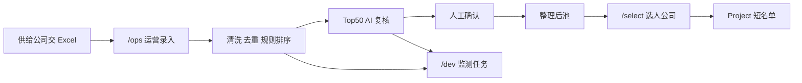

# UX 流程 — 三工作区

> 对照 [`PRD.md`](./PRD.md)、[`SCREEN-INVENTORY.md`](./SCREEN-INVENTORY.md)。
> 这些是 tinyship Nuxt **新 UI** 目标流，不是 `archive/` 单页，也不是 TinyShip 营销落地页。
> 线框可只读 archive；不要在 archive 上改交互当交付。

## 三个工作区

| 工作区 | 路由根 | 主用户 | 不是 |
|--------|--------|--------|------|
| 后台 · 运营录入 | `/{locale}/ops` | 平台运营 | 选人公司的短名单工作台 |
| 后台 · 开发运维监测 | `/{locale}/dev` | 开发 / 运维 | 达人筛选 UI |
| 前台 · 选人公司 | `/{locale}/select` | 选人策划 | 脏表清洗、规则改分 |

`locale`：`zh-CN` / `en` / `ko`。顶栏切换；`?lang=` 跳到前缀。浅色/深色可切。豁免原文：昵称、小红书号、原始关键词、手写备注。

## 主路径（M1 讲解）

1. 运维看 `/dev`：Key 是否存在、尚无成功批次（空态诚实）。
2. 运营登录 `/ops`：上传供给公司 Excel → 批次详情看到原始行 / 清洗 / 待补。
3. 运营开跑：清洗 + 六维排序。规则页只读核对权重。
4. `/dev` 出现 ingest / score 成功（或失败原因）。
5. 运营进 AI 队列：有 Key 真实复核，无 Key fallback。分数列不变。
6. 运营进人工队列：标 1 条「推荐」、1 条「不推荐」。再开详情，分不变。
7. 选人登录 `/select`：库里只有干净达人。建项目「春季试水」。分配 1 人、拒绝 1 人。
8. 运营导出评分表；选人导出短名单。讲解中途切 `en` / `ko` 与深色：chrome 变，分数与昵称原文不变。

完成标准：无 API Key 也能从步骤 2 走到 8。

## 角色路径

### 运营录入

上传 → 批次校对 → 跑分 → AI 队列 → 人工队列 → 作业导出。全程在 `/ops`。需要查管道时只读打开 `/dev/health` 或 `/dev/jobs`。

### 选人公司

打开干净库 → 筛等级/地区/关键词 → 进详情（无脏表）→ 分配到项目 → 改状态 → 导出短名单。看不到 `/ops/raw`、待补、任务失败。

### 开发运维

只转 `/dev`：健康、任务列表、失败详情、管道。不点「推荐达人」、不改分配。

## 权限跳转

| 从 | 到非法路由 | 行为 |
|----|------------|------|
| 选人 | `/ops/*` `/dev/*` | `AUTH-DENIED`，不返回脏 payload |
| 运营 | `/select/projects/:id` 写接口 | 403；M1 可读项目计数 |
| 运维 | `/ops` 写跑分 / `/select` 写分配 | 403 |
| 未登录 | 任一业务页 | 回 `AUTH-LOGIN` |

## 旧 Demo 不要抄的债

- 一张 SPA 里塞「情报台」+ 四个空导航（邮件触达等）。新 IA 三工作区，空导航如果出现必须写「未做」而不是假数据。
- 人工缓存用 `rank` 当键 → 全程 `creator_key`。
- `?lang=` + `dashboard-locale` 自造引擎 → 用 TinyShip 前缀 + `NEXT_LOCALE`。
- 把联系跟进叫「邮件触达」且当已交付。联系是后期，不是 M1。
- 选人页展示原始行号、缺失主键、排除脏标。那些只在 `/ops`。

## 与 V1 六页的关系

V1 计划要的是**作业闭环**，不是「只能有六个 URL」。六个面拆进运营 + 监测 + 前台之后，仍然是同一条：读表、排序、AI 解释、人工确认、导出；前台多出来的只是 **Project / Assignment**。
