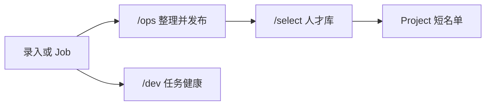

# UX 流程 — 挑好人 · 分到项目

> 对照 [`PRD.md`](./PRD.md)、[`SCREEN-INVENTORY.md`](./SCREEN-INVENTORY.md)。
> 新 UI，不是 archive Demo，不是 TinyShip 落地页。

## 三工作区

| 工作区 | 路由 | 主用户 | 主路径（目标步数） |
|--------|------|--------|-------------------|
| 前台选人 | `/{locale}/select` | 选人 | 库 → 详情 → 加入项目 → 改状态（≤4） |
| 后台录入 | `/{locale}/ops` | 运营 | 录/导/开 Job → 校对 → 发布（≤4） |
| 后台监测 | `/{locale}/dev` | 运维 | 健康 → 失败 Job → 看原因（≤3） |

语言 `zh-CN` / `en` / `ko`。浅/深色可切。未发布 Talent、Job 栈、源配置细节不进前台。

## 三条主路径

### A. 选人（前台）

1. 打开库：只见 `released`。空态：「还没有可人选，去找运营发布」——选人自己不能录入。
2. 筛 / 搜 → 打开一人。
3. 「加入项目」：选已有项目或当场建一个 → 确认 → 成为 `candidate` 或直接 `assigned`（默认 candidate）。
4. 项目页改成已分配 / 已拒绝 / 移出。移出可撤销回库（人仍 released）。

错：项目名空、重复分配同一人到同一项目（提示已在名单）。加载失败可重试，勾选不丢。

### B. 运营录入（后台）

**手录：** 工作台 → 录一人 → 存为 draft → 补必填变 ready → 确认发布。

**文件：** 工作台 → 选文件 Source → 确认导入 Job → 列表里校对 → 批量发布。

**自动任务：** 工作台 → 选已配置 Source → 确认开 Job（显示限速摘要）→ 等 `/dev` 变 ok → 回来发布新人。

撤销：未发布可改回 draft；已发布可「撤回前台」（确认）。不提供「改别人项目里的分配」。

### C. 开发运维（后台）

健康页看：服务、最后成功 Job、失败数、源是否启用。  
任务列表筛失败 → 展开原因 → 确认重试。  
**没有**人才表格、没有「加入项目」。

## 状态

| 对象 | 状态 | 谁改 |
|------|------|------|
| Talent | draft / ready / released | 运营 |
| Job | queued / running / ok / failed / cancelled | 运营开、运维重试/取消排队中的 |
| Assignment | candidate / assigned / rejected | 选人 |

切语言、切主题不改上述状态。

## 权限

| 角色 | 禁止 |
|------|------|
| 选人 | `/ops` 未发布列表、`/dev`、开 Job |
| 运营 | 写 Assignment（M1） |
| 运维 | 写 Talent 字段、写 Assignment、临时填未登记源 |

## 简明规则（做页时对照）

- 每屏一个主按钮；次要操作用次级样式。
- 写操作：确认或撤销，二选一至少有一个。
- 空态只给一个下一步。
- 错态说人话 + 能回去。
- `/dev` 看起来像运维，不像选人后台换皮。

## 历史 Demo

旧六页（控制台/榜单/评分/AI/导出）不映射为本产品 IA。需要对照线框时只读 `archive/`，不要抄成产品结构。
